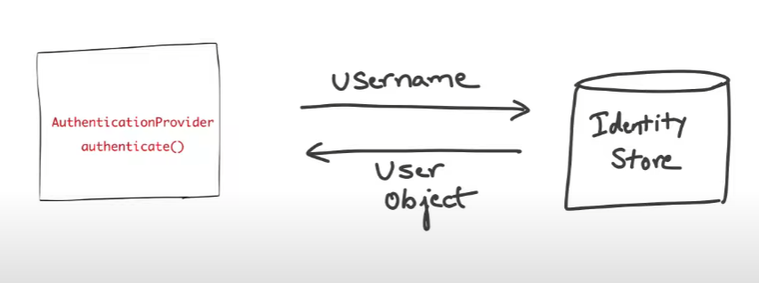

# How Spring Security Authentication works

## Servlet Applications <a id="servlet-applications"></a>

> Spring Security integrates with the Servlet Container by using a standard Servlet . This means it works with any application that runs in a Servlet Container. More concretely, you do not need to use Spring in your Servlet-based application to take advantage of Spring Security. `Filter`

## Filters





## AuthenticationProvider


## UserDetailService




## How it works


### SecurityContextHolder

> **SecurityContextHolder, SecurityContext and Authentication Objects**
>
> The most **fundamental** object is `SecurityContextHolder`. This is where we store details of the present security context of the application, which includes details of the principal currently using the application. By default the `SecurityContextHolder` uses a `ThreadLocal` to store these details, which means that the security context is always available to methods in the same thread of execution, even if the security context is not explicitly passed around as an argument to those methods. Using a `ThreadLocal` in this way is quite safe if care is taken to clear the thre

### Principal 가져오기

```java
Object principal = SecurityContextHolder.getContext().getAuthentication().getPrincipal();

if (principal instanceof UserDetails) {
    String username = ((UserDetails)principal).getUsername();
} else {
    String username = principal.toString();
}
```

## 참조







[https://velog.io/@16616516/%EC%84%9C%EB%B8%94%EB%A6%BF-%EC%BB%A8%ED%85%8C%EC%9D%B4%EB%84%88%EC%99%80-%EC%8A%A4%ED%94%84%EB%A7%81-%EC%BB%A8%ED%85%8C%EC%9D%B4%EB%84%88](https://velog.io/@16616516/%EC%84%9C%EB%B8%94%EB%A6%BF-%EC%BB%A8%ED%85%8C%EC%9D%B4%EB%84%88%EC%99%80-%EC%8A%A4%ED%94%84%EB%A7%81-%EC%BB%A8%ED%85%8C%EC%9D%B4%EB%84%88)


